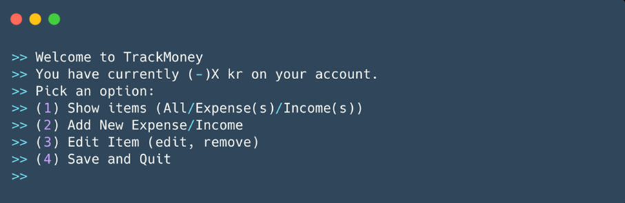

# Project_MoneyTrackingApplication
## Summary

**Goal:** Build a money tracking application

**Requirements:**
	•	Model an item with title, amount, and month. (Solve the problem where you have to distinguish income and expense) 
	•	Display a collection of items that can be sorted in ascending or descending order. Sorted by month, amount or title
	•	Display only expenses or only incomes
	•	Support the ability to edit, and remove items 
	•	Support a text-based user interface 
	•	Load and save items list to file
	
**UI:**

## System Design

**Requirements:**
	•	Because this is a bank system, so all variables that relate to money must be decimal.
	•	Each item has a unique ID in the system. The ID is a byte variable because this project is not going to create more than 100 items.
	•	Clean the screen every time the user returns to the menu.
	•	The system loads the save file when it opens, if the file exists.
	
**System Design:**
	1.	A variable that tracks and displays current amount of the money in the account. 
	2.	A list for menu.
	3.	In option 1, there are 3 options, all, expense and income, you could choose. The default order of list of all options sorts by month and in descending order. After the system displays the list, the user could choose sort by month, amount or title and sort in ascending or descending order. The user also could choose return to the menu. 
	4.	According to the picture of UI, withdrawal/deposit functions are in the same option “Add New Expense/Income”. But Chatgpt said that in a banking system design, it’s generally better to keep expense (withdrawal/debit) and income (deposit/credit) as separate functions, even though they both modify the balance. This improves security, clarity, and control. Therefore, there are 3 options, Expense, Income and return to menu, in the option 2. The order of input of expense/income is title, amount, and then month. The amount is limit to 2 decimals. The months are display in 2 digits numbers, from 01 to 12. 
	5.	In option 3, the system displays the list with unique ID. After that, the user could choose edit item, remove item and return to menu. To edit or remove item, the user input the ID of the item. In edit option, the user could choose edit month, amount, title or all. 
	6.	In option 4, save date in a file and end the program. If there isn’t a file, then the program creates it automatically. 
	
**Test**
	1. Menu displays without problem. (Done)
	2. Option 1
	3. Option 2
	4. Option 3
	5. Option 4
	6. Final System test
