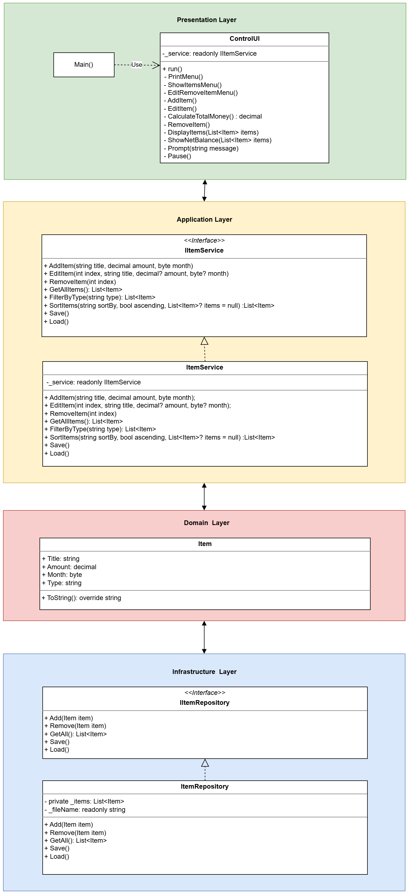

# TrackMoney — Console Money tracking application
Lightweight console application to record and review personal income and expenses. The app is implemented with a small, layered architecture so business logic is separated from persistence and the UI.

## Key points
- Language: C# (project set to C# 14.0)
- Target framework: .NET 10
- Storage: JSON file (`data.json`) saved next to the running binary

## Features
- Add income or expense items (title, amount, month)
- Edit or remove items
- Filter (all / incomes / expenses) and sort (title, amount, month) adn view items
- Color-coded console output (green = income, red = expense)
- Persist data across runs via `data.json`

## UML

## Usage summary
- Start the program and follow the on-screen menu.
- Add items with positive amounts for incomes and negative amounts for expenses (the UI/service determine `Type`).
- Use the Show Items menu to filter and sort results, and to view a summarized net balance.
- Select Save and Quit to write `data.json`.

## Data storage
- Items are serialized to a JSON file named `data.json` in the working directory. The repository implementation reads the file on service startup and writes it on save.

## Future Work
- Encrypting data.json to protect sensitive financial information.

## Usage of AI
This project was developed with the assistance of AI tools for code generation and documentation. 
The AI was used to:
1. build the initial project structure and implement core features based on the the UI that I designed.
2. Generate README documentation based on the implemented code and features after I completed the modifications and testing.

AI is a useful tool for generating code and documentation, but it is not perfect. I reviewed and tested the generated code to ensure it met the requirements and functioned correctly.
The AI changes my UI design and I had to modify the code and UI to fit my original design. Also, the AI generated the code in a way that I don't understand, so I had to spend time understanding the code and modifying it to fit my needs.
It feels like I had working with a junior developer who needed guidance and supervision to produce good code. The AI can generate code quickly, but it may not always follow best practices or understand the nuances of the project requirements.
Documentation generated by AI can be helpful, but it may not always be accurate or complete. I had to review and edit the generated documentation to ensure it accurately reflected the implemented features and usage instructions.

## Conclusion
It is great for create a MVP because it gives you inspiration and a starting point, but it is not for producing production-ready code without human review and modification.
Working with AI alone is like working with a junior developer. It saves time, but it is not that much people think in internet. Because AI can generete code in a way you don't understand, you may end up spending more time trying to understand and modify the generated code than if you had written it yourself from the beginning. 
I like the experience of working with AI. As long as you know the risk on the AI generated code and documentation, it is fine. 

